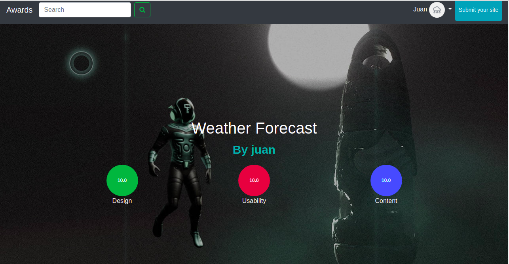

## Awards

## Author
[Joan Kirui](https://github.com/joankirui)

## Description

This is a django application that allows users to post their projects for others to rate and review based on usability,content and design.

## Live Link
To view site [click here](https://jkawards.herokuapp.com/)

## User Story
* A user can view posted projects and their details.
* A user can post a project to be rated/reviewed.
* A user can rate/ review other users' projects.
* Search for projects.
* View projects overall score.
* A user can view their profile page.

## Setup and Installation
    To get the project ...

### Cloning the repository:
    https://github.com/joankirui/Awards.git

### Navigate into the folder and install requirements
    cd Awards pip install -r requirements.txt

### Install and activate Virtual
    - python3.6 -m venv virtual 
    - source virtual/bin/activate  

# Setup Database 
* SetUp your database User,Password,Host then make migrate
   - python manage.py makemigrations awards

* Now Migrate 
   - python manage.py migrate 

* Run the application
   - python3.6 manage.py runserver

* Testing the application
   - python manage.py test

* Open the application on your browser 
   - 127.0.0.1:8000.

## Api Endpoints:
* [Profile](https://jkawards.herokuapp.com/api/profile)

* [Projects](https://jkawards.herokuapp.com/api/posts)

## Technology used
    python3.6
    Django 3.2.9
    Heroku

## Known Bugs
* There are no known bugs currently but pull requests are allowed incase you spot a bug

## Contact Information
    If you have any question or contributions, please email me at [joankirui99@gmail.com]

## License

Copyright © 2021  [JOAN KIRUI](https://github.com/joankirui)

